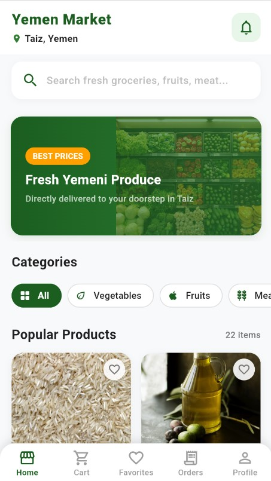
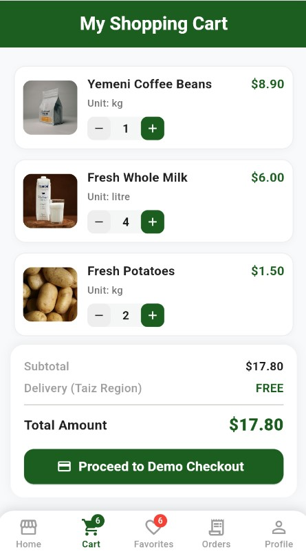
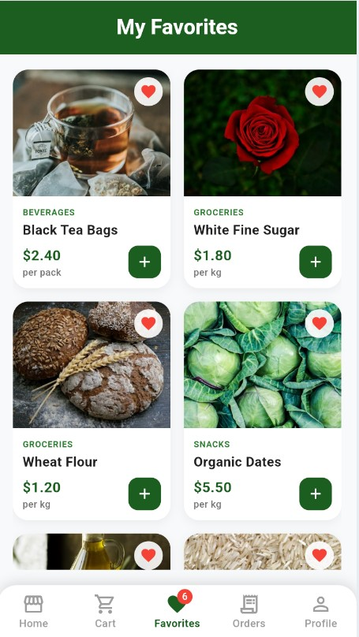
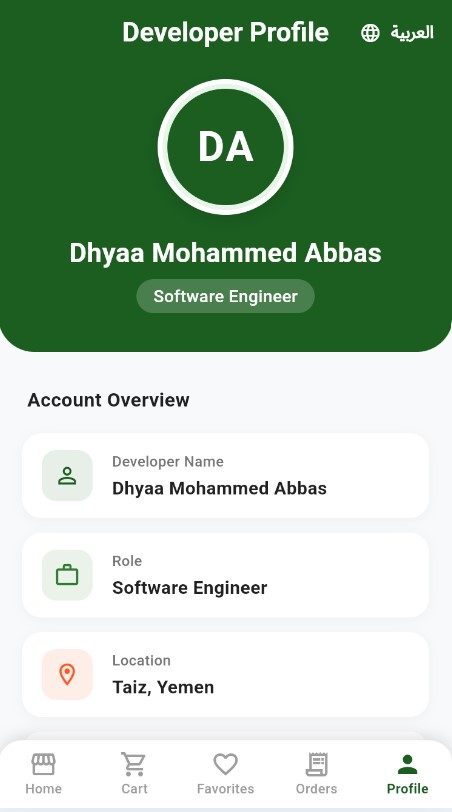
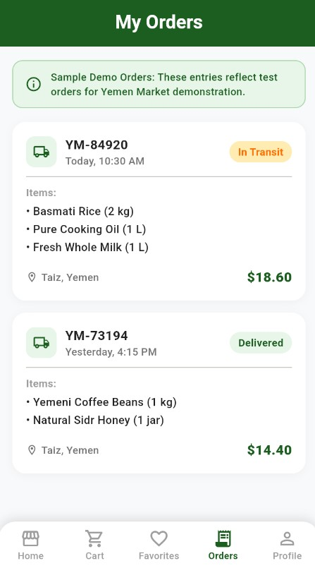

# 🛒 Yemen Market 🇾🇪

A modern and responsive Flutter e-commerce application designed to provide a simple, clean, and user-friendly shopping experience for the Yemen market.

Yemen Market allows users to browse products, explore categories, search for products, view detailed product information, manage favorites, add products to their shopping cart, and review their orders through a modern mobile-first interface.

---

## 📱 Screenshots

<p align="center">
  
  
  
</p>

<p align="center">
  
  
  
</p>

---

## ✨ Features

### 🏠 Home & Discovery

- Modern and responsive home page
- Product search
- Popular products section
- Product categories
- Category-based browsing
- Clean product cards
- Yemen-focused branding and location

### 🛍️ Products

- Browse available products
- View product details
- Product images
- Product descriptions
- Product pricing
- Product quantity selection
- Similar products

### ❤️ Favorites

- Add products to favorites
- Remove products from favorites
- Dedicated favorites page
- Favorite product counter

### 🛒 Shopping Cart

- Add products to cart
- Increase product quantity
- Decrease product quantity
- Remove products from cart
- Automatic subtotal calculation
- Delivery information
- Total amount calculation
- Checkout interface

### 📦 Orders

- View orders
- Order information
- Order history interface
- Dedicated orders section

### 👤 Profile

- User profile interface
- Account-related navigation
- Clean profile layout

### 🧭 Navigation

- Bottom navigation bar
- Home
- Cart
- Favorites
- Orders
- Profile

---

## 🎨 UI & Design

Yemen Market focuses on simplicity, usability, and a clean shopping experience.

### Design Highlights

- 🌿 Green-based visual identity
- ⚪ Clean white product cards
- 📱 Responsive mobile interface
- 🎨 Minimal and modern design
- 🛍️ Product-focused layouts
- 🔎 Simple search experience
- 🧭 Easy navigation
- 🇾🇪 Yemen-focused branding

The interface is designed to feel familiar and easy to use while maintaining a modern e-commerce appearance.

---

## 🛠️ Tech Stack

| Technology | Purpose |
|------------|---------|
| **Flutter** | Cross-platform application development |
| **Dart** | Programming language |
| **Material Design** | UI components and design system |
| **Google Fonts** | Typography |
| **Stateful Widgets** | Local UI and state updates |
| **Stateless Widgets** | Reusable UI components |
| **Local Data Structures** | Product and application data |

---

## 🏗️ Project Architecture

The current version follows a simple Flutter structure focused on reusable UI components and local application logic.

```text
lib/
├── main.dart
│
├── home_page.dart
├── details.dart
├── Cart.dart
├── Fav.dart
├── Order.dart
├── Prof.dart
├── navbar.dart
│
└── util/
    ├── box_cont.dart
    ├── list.dart
    ├── pagev.dart
    └── qtybox.dart
````

### Main Screens

* `home_page.dart` → Home and product discovery
* `details.dart` → Product details
* `Cart.dart` → Shopping cart
* `Fav.dart` → Favorites
* `Order.dart` → Orders
* `Prof.dart` → User profile
* `navbar.dart` → Bottom navigation

### Reusable Components

The `util/` directory contains reusable UI components used throughout the application.

---

## 🔐 Backend & Authentication

The current version is focused on the **frontend experience and local application logic**.

There is currently:

* ❌ No Firebase
* ❌ No external backend
* ❌ No online database
* ❌ No authentication system
* ❌ No real payment gateway
* ❌ No real-time order processing

Product data, cart state, favorites, and other interactions are currently handled locally within the application.

The project structure is intended to be extended with backend services in future versions.

---

## 🚀 Getting Started

### Prerequisites

Make sure you have the following installed:

* Flutter SDK
* Dart SDK
* Android Studio or another supported IDE
* Android Emulator, physical Android device, or Chrome

Check your Flutter installation:

```bash
flutter doctor
```

---

### 1. Clone the Repository

```bash
git clone https://github.com/engdheya/yemen-market-flutter.git
```

Navigate to the project:

```bash
cd yemen-market-flutter
```

---

### 2. Install Dependencies

```bash
flutter pub get
```

---

### 3. Run the Application

```bash
flutter run
```

To run the application on Chrome:

```bash
flutter run -d chrome
```

---

## 📂 Project Structure

```text
yemen-market-flutter/
│
├── android/
├── ios/
├── web/
├── linux/
├── macos/
├── windows/
│
├── assets/
│   └── Screenshots/
│       ├── Home.jpg
│       ├── Details.jpg
│       ├── Cart.jpg
│       ├── Fav.jpg
│       ├── Profile.jpg
│       └── Orders.jpg
│
├── lib/
│   ├── main.dart
│   ├── home_page.dart
│   ├── details.dart
│   ├── Cart.dart
│   ├── Fav.dart
│   ├── Order.dart
│   ├── Prof.dart
│   ├── navbar.dart
│   │
│   └── util/
│       ├── box_cont.dart
│       ├── list.dart
│       ├── pagev.dart
│       └── qtybox.dart
│
├── pubspec.yaml
├── analysis_options.yaml
└── README.md
```

---

## 🧩 Application Flow

```text
Home
 │
 ├── Search Products
 │
 ├── Browse Categories
 │
 └── Select Product
       │
       ▼
   Product Details
       │
       ├── Add to Favorites
       │
       └── Add to Cart
              │
              ▼
          Shopping Cart
              │
              ├── Update Quantity
              ├── Remove Product
              └── View Total
                     │
                     ▼
                  Checkout
```

---

## 📌 Current Project Status

**Status: 🚧 In Development**

The current release focuses on building the application's user interface, navigation, product browsing experience, favorites, shopping cart, and order interfaces.

### Current

* ✅ Flutter UI
* ✅ Product browsing
* ✅ Categories
* ✅ Product search
* ✅ Product details
* ✅ Favorites
* ✅ Shopping cart
* ✅ Quantity management
* ✅ Orders interface
* ✅ Profile interface
* ✅ Bottom navigation
* ✅ Responsive layouts
* ✅ Local application state

---

## 🔮 Future Improvements

Planned improvements for future versions include:

* 🔐 User authentication
* ☁️ REST API / Backend integration
* 🗄️ Online product database
* 👤 User account management
* 🛒 Server-side shopping cart
* 📦 Real order processing
* 💳 Payment gateway integration
* 📍 Address and delivery management
* 🚚 Delivery tracking
* 🔔 Push notifications
* 🔎 Advanced product filtering
* ⭐ Product reviews and ratings
* 👨‍💼 Admin dashboard
* 📊 Sales and order management
* 🌐 Multi-language support

---

## 🎯 Project Goals

Yemen Market is designed as a foundation for a complete digital shopping platform targeting customers in Yemen.

The main goals are:

1. Provide a simple shopping experience.
2. Create a modern and accessible mobile interface.
3. Make product discovery fast and intuitive.
4. Build a scalable foundation for future backend integration.
5. Support future delivery, payment, and order management features.
6. Create a localized e-commerce experience for the Yemeni market.

---

## 👨‍💻 Developer

**Dhyaa Mohammed Abbas**

Software Engineer

GitHub: [@engdheya](https://github.com/engdheya)

---

## 📄 License

This project is currently developed as a personal software project and portfolio application.

---

## 🙏 Acknowledgements

Developed and customized using **Flutter & Dart**.

